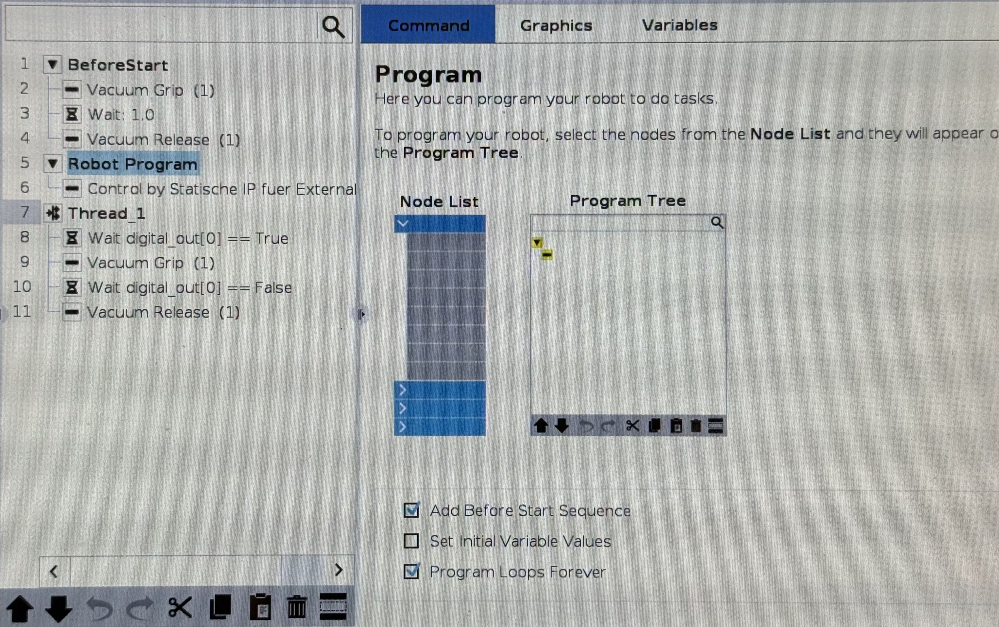
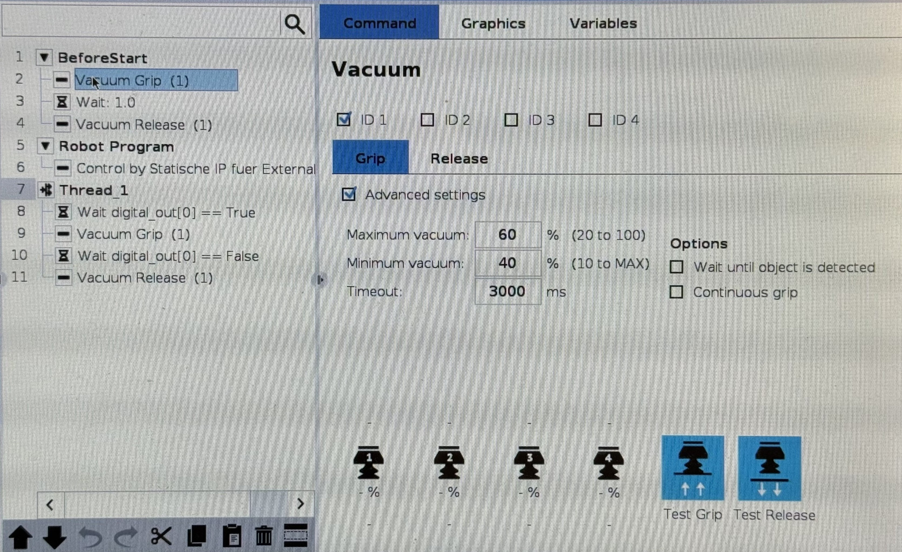
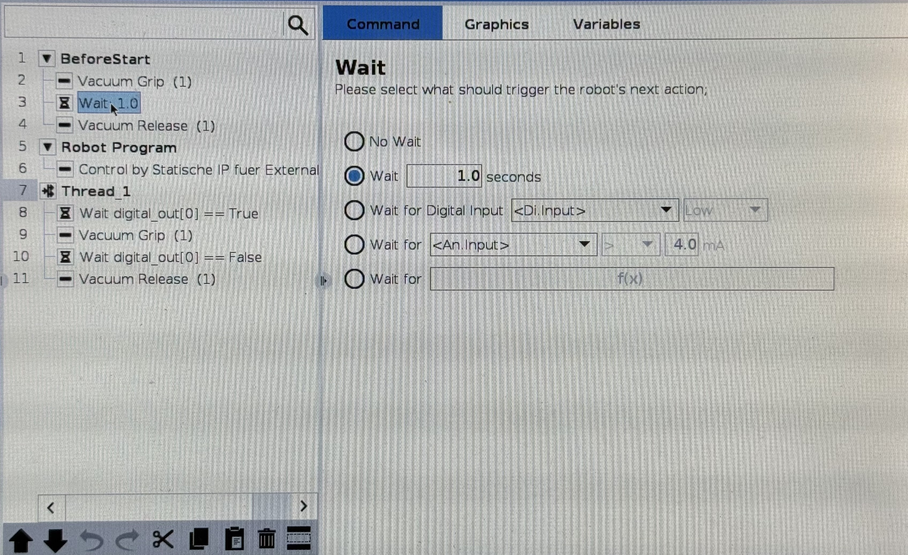
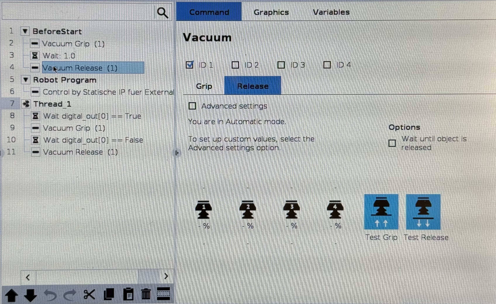
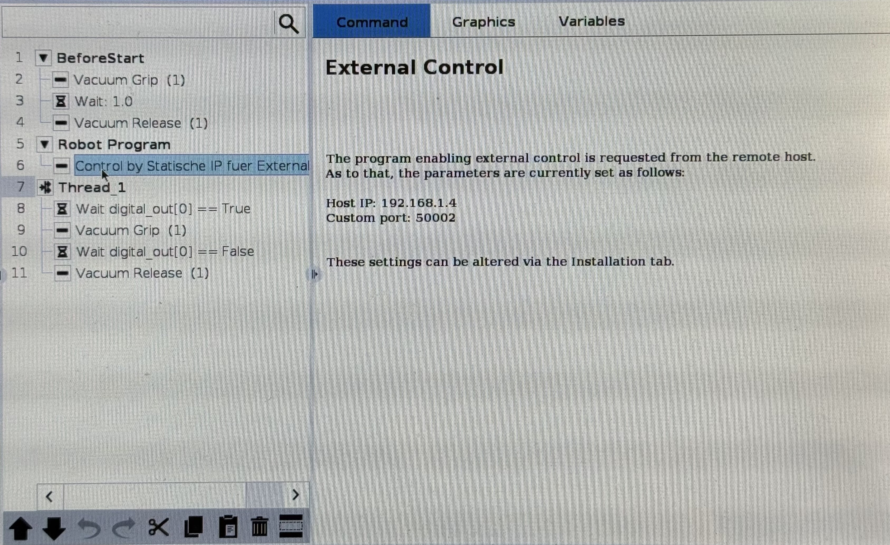
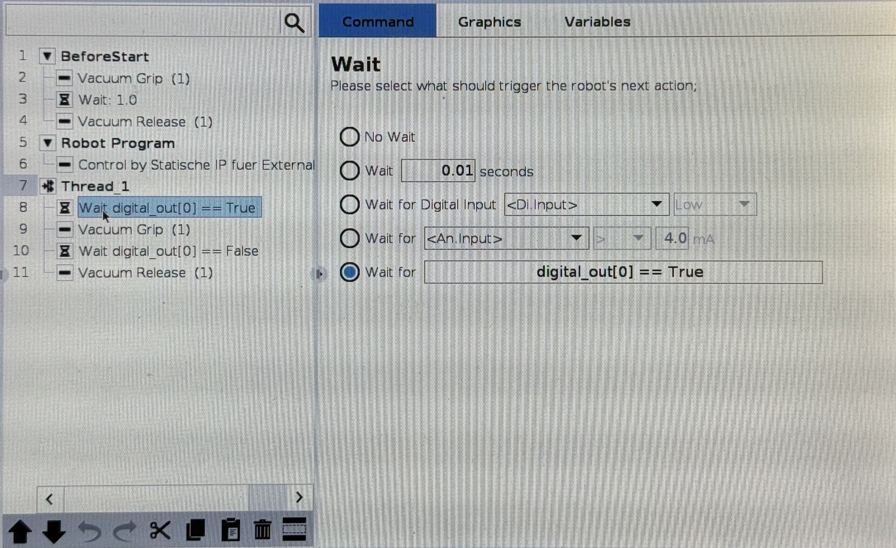
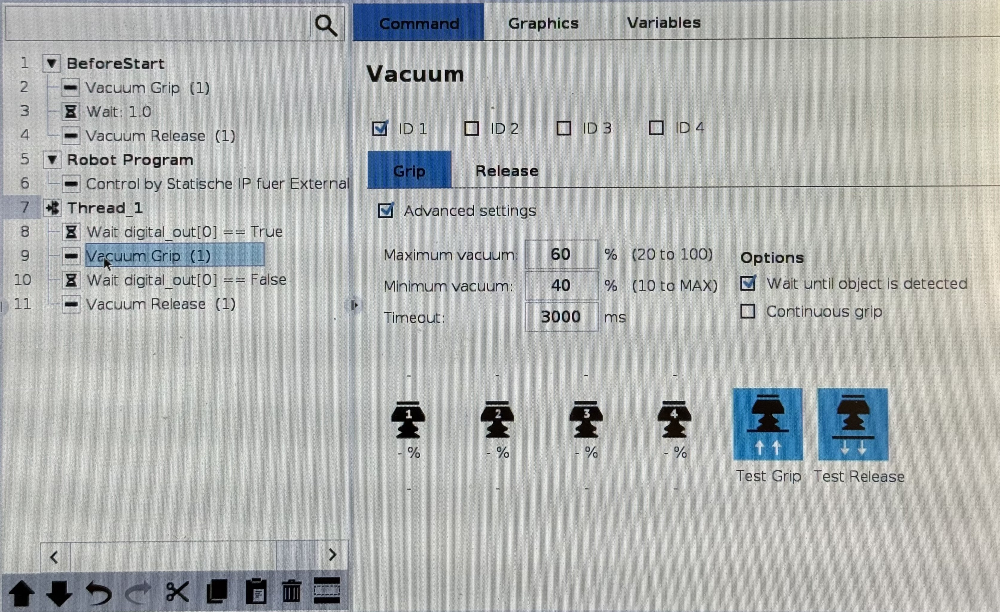
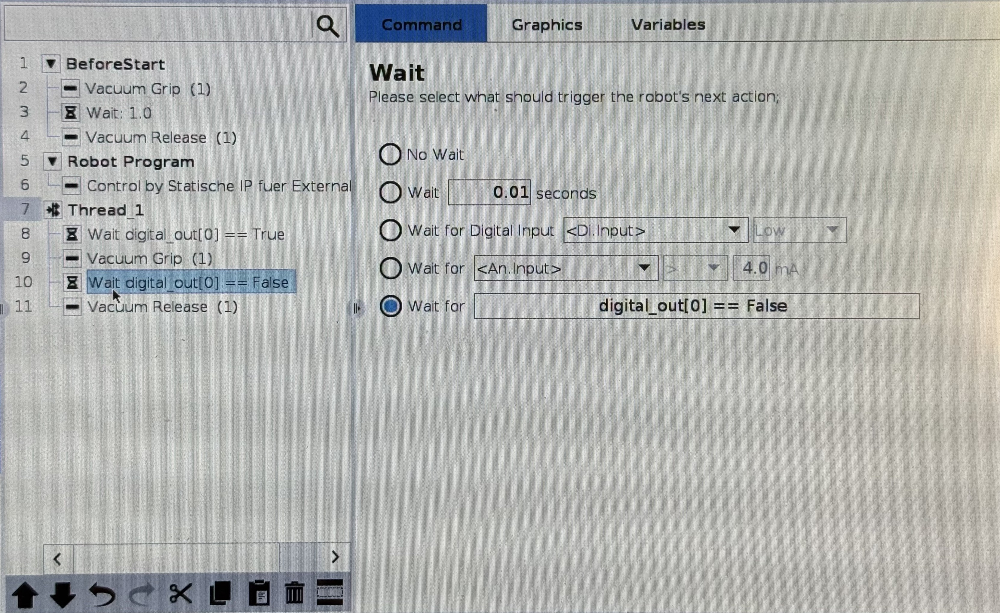
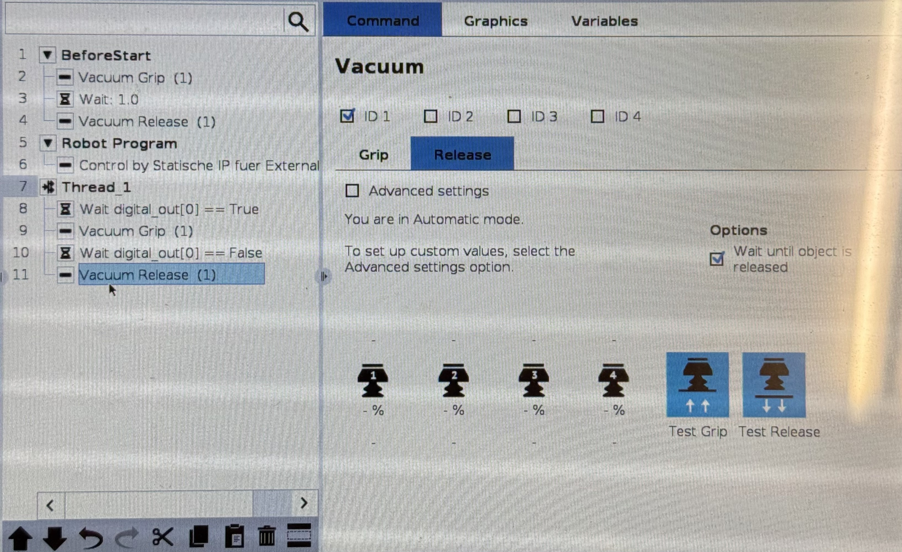

# PolyScope 5 Robot Program Setup

This document outlines how to set up the PolyScope 5 robot program on the teach pendant. This specific program structure is required to bridge **ROS 2 (via External Control)** with the UR5e and the **Robotiq EPick Vacuum Gripper**.

---

## Why this structure?

Ideally, the gripper would be controlled directly via a dedicated ROS 2 Action Server or hardware interface. However, **because there is currently no functional, native ROS 2 Jazzy package available for the Robotiq EPick**, we had to rely on a digital I/O workaround.

When ROS 2 takes over the robot using the `External Control` node, the main robot program execution is blocked. To control the Robotiq gripper without interrupting the connection, we must use a parallel **Thread** in PolyScope that continuously listens to the robot's digital I/O pins. Our ROS 2 `pick_and_place` node triggers these pins remotely via the `/io_and_status_controller/set_io` service.

---

## I) Program Overview

The program consists of three main components:
1. **BeforeStart:** Initializes and tests the hardware before handing over control to ROS.
2. **Robot Program:** The main loop that yields control to the external ROS 2 PC.
3. **Thread_1:** A parallel background process that translates digital I/O signals from ROS 2 into physical gripper actions.



> [!IMPORTANT]
> Ensure that the checkbox **"Program Loops Forever"** at the bottom of the Program Tree is **checked**.

---

## II) Step-by-Step Configuration

### Part 1: `BeforeStart` (Gripper Self-Test)

This sequence performs a quick check to ensure the EPick vacuum pump is responsive before starting the main application.

1. **Vacuum Grip:**
   * Select `Grip` in the Vacuum Node
   * Check `Adcanced Settings` and set the parameters as follows:
     * Set Max to `60%`, Min to `40%`, and Timeout to `3000 ms`



2. **Wait:**
    * Set a short delay between the grip and release commands (e.g., `1.0` seconds)



3. **Vacuum Release:**
   * Select `Release` in the Vacuum Node




### Part 2: `Robot Program` (ROS 2 Bridge)

This section contains only a single node to establish the connection with ROS 2.

**External Control:**
   * Insert the External Control node (provided by the [**External Control URCap**](https://docs.universal-robots.com/Universal_Robots_ROS2_Documentation/doc/ur_client_library/doc/setup/robot_setup.html#urcap-installation)).
   * Ensure the Host IP matches your ROS 2 System (in our case `192.168.1.4`). These settings are configured in the **Installation tab** of PolyScope.




### Part 3: `Thread` (Gripper Control)

This thread runs continuously in the background. It monitors `digital_out[0]` which is manipulated by our [``pick_and_place.py`` ROS 2 node](#iii-how-ros-2-interacts-with-the-gripper) and triggers the corresponding URCap commands.

1. **Wait:** 
    * Select `Wait for f(x)` and enter `digital_out[0] == True`. This pauses the thread until ROS 2 sends a grip command.



2. **Vacuum Grip:**
    * Select `Grip` in the Vacuum Node
    * Check `Adcanced Settings` and set the parameters as follows:
      * Set Max to `60%`, Min to `40%`, and Timeout to `3000 ms`
      * Check `Wait until object is detected`. *(This ensures the pump builds sufficient vacuum before the arm moves away).*



3. **Wait:** 
   * Select `Wait for f(x)` and enter `digital_out[0] == False`. This pauses the thread until ROS 2 sends a release command.



4. **Vacuum Release:**
   * Select `Release` in the Vacuum Node
   * Check `Adcanced Settings` and set the parameters as follows:
     * Check `Wait until object is released`. *(This ensures the item has dropped before the robot moves to the next task).*



---

## III) How ROS 2 Interacts with the Gripper

In our ROS 2 orchestrator (`workcell_application`), we do not use a dedicated gripper action server. Instead, we call the standard UR I/O service to flip `digital_out[0]`, which the PolyScope thread instantly reacts to:

```python
# From pick_and_place.py
req = SetIO.Request()
req.fun = 1  # 1 = Standard Digital Output
req.pin = 0  # Targets digital_out[0] in PolyScope

if activate:
    req.state = 1.0 # Sets digital_out[0] = True -> Triggers Vacuum Grip
else:
    req.state = 0.0 # Sets digital_out[0] = False -> Triggers Vacuum Release

self.io_client.call_async(req)
```

---

Back to [II) Installation and Setup](/README.md#ii-installation-and-setup)