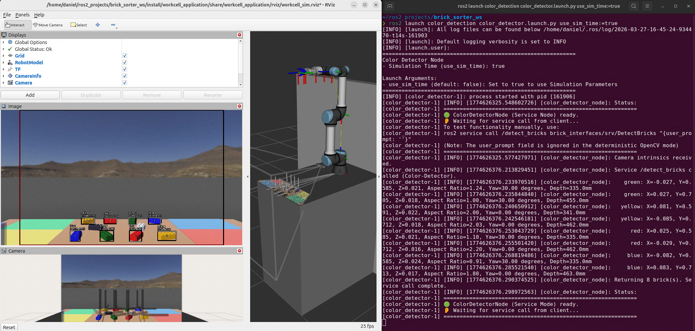
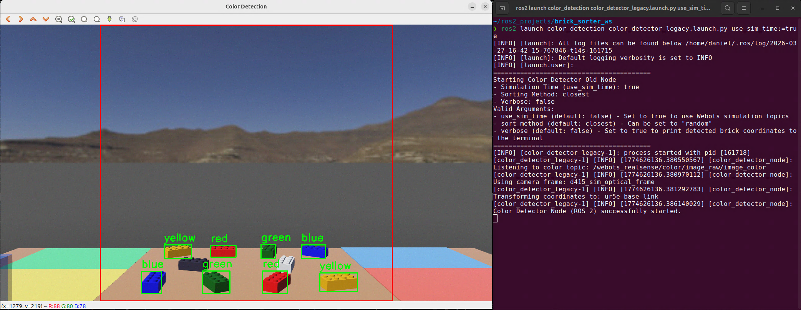
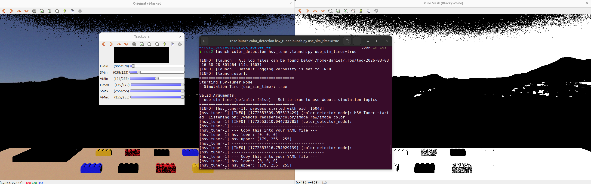

# Color Detection Package (`color_detection`) <!-- omit from toc -->

[![jazzy][jazzy-badge]][jazzy]
[![ubuntu24][ubuntu24-badge]][ubuntu24]

[jazzy-badge]: https://img.shields.io/badge/-ROS%202%20JAZZY-orange?style=flat-square&logo=ros
[jazzy]: https://docs.ros.org/en/jazzy/index.html
[ubuntu24-badge]: https://img.shields.io/badge/-UBUNTU%2024%2E04-blue?style=flat-square&logo=ubuntu&logoColor=white
[ubuntu24]: https://releases.ubuntu.com/noble/


This package detects colored Lego bricks using a camera stream (RGB + Depth). It generates precise bounding boxes by applying configurable HSV color masks and contour detection to the RGB image. By mapping these 2D bounding boxes to the aligned depth map, it calculates the 3D coordinates of each brick relative to the robot's base frame and provides this data to the ROS 2 network.

- [I) Package Structure](#i-package-structure)
- [II) Services, Topics \& Custom Messages](#ii-services-topics--custom-messages)
- [III) Configuration \& Camera Setup (YAML)](#iii-configuration--camera-setup-yaml)
- [IV) Launch color\_detector (Service Node)](#iv-launch-color_detector-service-node)
- [V) Launch color\_detector\_legacy (Topic-based Node)](#v-launch-color_detector_legacy-topic-based-node)
- [VI) Using the HSV Tuner](#vi-using-the-hsv-tuner)
- [VII) How to Add a New Color (e.g., 'orange')](#vii-how-to-add-a-new-color-eg-orange)


# I) Package Structure

* **`color_detector.py`**: The main ROS 2 node. It acts as a Multi-threaded Service Server that provides on-demand brick detection (`/detect_bricks`). It uses `tf2` to transform coordinates and dynamically broadcasts TF frames for RViz. It also publishes a continuous live annotated image stream.
* **`color_detector_legacy.py`**: The old version adapted from ROS 1. It continuously processes images and publishes the best target brick to the `/lego_brick_info` topic using a timer.
* **`color_functions.py`**: A pure Python helper module containing the OpenCV logic for HSV masking and contour detection. It is completely independent of ROS.
* **`hsv_tuner.py`**: A standalone ROS 2 GUI tool. It opens an OpenCV window with trackbars, allowing you to fine-tune HSV values in real-time.


# II) Services, Topics & Custom Messages

This package relies on the **`brick_interfaces`** package for custom message and service definitions.

**Service Server (`color_detector.py`):**
* `/detect_bricks` (`brick_interfaces/srv/DetectBricks`): Evaluates the current camera frame on demand and returns an array of all valid detected `LegoBrick` objects. 

**Published Topics (`color_detector.py`):**
* `/annotated_image` (`sensor_msgs/Image`): Publishes a live, non-blocking visualization of detected bounding boxes, 3D coordinates, and safe zones at 6 Hz for RQT/RViz.
* `/tf`: Broadcasts individual `TransformStamped` frames for every detected brick (e.g., `brick_red_0`) relative to the robot's base frame.

**Message Format (`brick_interfaces/msg/LegoBrick`):**
The service response returns an array of these messages.
```text
geometry_msgs/PointStamped position  # Transformed 3D coordinates in the robot's base frame
std_msgs/String color                # The detected color name (e.g., "red", "blue")
float32 camera_distance_mm           # Raw depth distance from the camera lens to the brick
float32 yaw_degrees                  # Calculated brick orientation (0.0 or 30.0 degrees) based on aspect ratio
int32[] bounding_box_px              # Bounding box array [xmin, ymin, xmax, ymax]
```

# III) Configuration & Camera Setup (YAML)

We use parameter files in the `config/` directory to seamlessly switch between Webots simulation and real-world hardware, and to manage color thresholds:

  * **`sim_parameters.yaml` / `real_parameters.yaml`**: Store the camera topic names and the target `tf2` frames.
  * **`hsv_bounds.yaml`**: Centrally stores the HSV color thresholds for all detected colors.

> [!IMPORTANT]
> Before running the node on a new setup, you must adjust the camera topics and the `tf2` frames in the respective parameters YAML file, as well as the HSV bounds.

Example `sim_parameters.yaml`:

```yaml
color_detector_node:
  ros__parameters:
    # --- Camera Topics ---
    camera_info_topic: '/webots_realsense/depth/image_rect_raw/camera_info'
    depth_image_topic: '/webots_realsense/depth/image_rect_raw/image'
    color_image_topic: '/webots_realsense/color/image_raw/image_color'

    # Frame of the camera for TF transformations
    camera_frame: 'd415_sim_optical_frame'

    # Target frame for the 3D coordinates
    robot_base_frame: 'ur5e_base_link'
```

Example `hsv_bounds.yaml`:

```yaml
color_detector_node:
  ros__parameters:
    # --- HSV Color Thresholds ---
    hsv_red_lower: [0, 145, 100]
    hsv_red_upper: [10, 255, 255]

    hsv_yellow_lower: [16, 128, 117]
    hsv_yellow_upper: [53, 255, 255]

    hsv_green_lower: [28, 143, 0]
    hsv_green_upper: [73, 255, 255]

    hsv_blue_lower: [86, 168, 175]
    hsv_blue_upper: [147, 255, 255]
```

# IV) Launch color_detector (Service Node)




This launches the service server:

```bash
ros2 launch color_detection color_detector.launch.py use_sim_time:=true # must be true for Webots simulation
```

To test the functionality manually via the terminal, use:

```bash
ros2 service call /detect_bricks brick_interfaces/srv/DetectBricks"
```

To view the live annotated image stream, use RQT:

```bash
rqt
```
In RQT go to Plugins → Visualization → Image View, then select the `/annotated_image` topic.

Alternatively, you can visualize the detected bricks and their TF frames in RViz:

```bash
ros2 launch workcell_application rviz.launch.py use_sim_time:=true # must be true for Webots simulation
```


## Edge Margins (Safe Zone) <!-- omit from toc -->

To ensure reliable grasping and accurate depth calculations, the detector implements edge margins on the camera frame. Bricks that touch or cross this margin are deliberately ignored. This applies to the legacy node as well.

  * Default `edge_margin_x`: 100 pixels
  * Default `edge_margin_y`: 1 pixel
  
These margins are drawn as a red safe-zone rectangle in the `/annotated_image` stream.

# V) Launch color_detector_legacy (Topic-based Node)



> [!IMPORTANT]
> The ``color_detector_legacy`` node only works with the ``brick_sorter_legacy`` node and vice versa!
It does not work with the real hardware (gripper control) yet, only simulated in Webots.

If you want to try the old version adapted from ROS 1, which continuously processes images and publishes the best target brick to a topic, use this launch command:

```bash
ros2 launch color_detection color_detector_legacy.launch.py use_sim_time:=true # must be true for Webots simulation
```

This node evaluates all targets and publishes only the best target brick to `/lego_brick_info` using a 1.0-second timer.

### Sorting Method (Endless Loop Prevention) <!-- omit from toc -->

By default, the legacy node selects the brick with the shortest camera depth (closest to the lens). If the robot repeatedly fails to grasp a specific target, it can get stuck in an endless loop. To prevent this, you can randomize the target selection by using the launch argument `sort_method:=random`.

# VI) Using the HSV Tuner



To find the perfect HSV color thresholds for your environment, use the built-in tuning tool. It opens a live video feed with trackbars and automatically loads the correct camera topics based on your configuration.

```bash
ros2 launch color_detection hsv_tuner.launch.py use_sim_time:=true # must be true for Webots simulation
```

1.  Adjust the trackbars until the `Pure Mask` window clearly shows your target object in solid white and everything else in black.
2.  The node automatically prints the YAML-formatted values to your terminal every 2 seconds.
3.  Copy the printed array values from the terminal, and paste them into your **`hsv_bounds.yaml`** configuration file.

# VII) How to Add a New Color (e.g., 'orange')

Adding a new color requires exactly three steps, without touching the core image processing logic:

## Step 1: Add the HSV bounds to your `hsv_bounds.yaml` file <!-- omit from toc -->

```yaml
#   hsv_color_lower: [H, S, V]
#   hsv_color_upper: [H, S, V]

    hsv_orange_lower: [5, 150, 150]
    hsv_orange_upper: [15, 255, 255]
```

## Step 2: Declare and map the parameters in Python <!-- omit from toc -->

In the `__init__` function of your detector node (`color_detector.py`), declare the parameters and map them into the dictionary:

```python
        self.declare_parameter('hsv_orange_lower', [0, 0, 0])
        self.declare_parameter('hsv_orange_upper', [255, 255, 255])
        
        # Add to self.color_bounds dictionary:
        self.color_bounds = {
            # ... existing colors ...
            'orange': {
                'lower': np.array(self.get_parameter('hsv_orange_lower').value),
                'upper': np.array(self.get_parameter('hsv_orange_upper').value)
            }
        }
```

## Step 3: Add the color to the processing list <!-- omit from toc -->

Inside the `detect_callback` function in ``color_detector`` (or `image_callback` in ``color_detector_legacy``), simply add the string to the list:

```python
        colors = ['green', 'yellow', 'red', 'blue', 'orange']
```

---