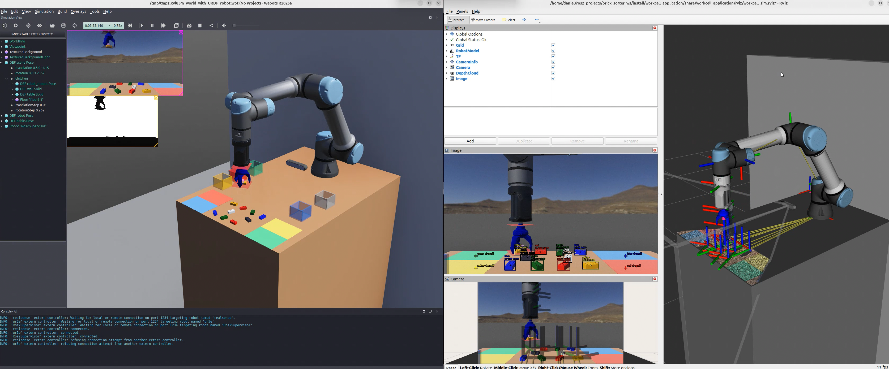

# Workcell Application Package (`workcell_application`) <!-- omit from toc -->
[![jazzy][jazzy-badge]][jazzy-link]
[![ubuntu24][ubuntu24-badge]][ubuntu24-link]
[![gemini][gemini-badge]][gemini-link]

[jazzy-badge]: https://img.shields.io/badge/-ROS%202%20JAZZY-orange?style=flat-square&logo=ros&logoColor=white
[jazzy-link]: https://docs.ros.org/en/jazzy/index.html
[ubuntu24-badge]: https://img.shields.io/badge/-UBUNTU%2024%2E04-blue?style=flat-square&logo=ubuntu&logoColor=white
[ubuntu24-link]: https://releases.ubuntu.com/noble/
[gemini-badge]: https://img.shields.io/badge/-GEMINI%20API-7C4DFF?style=flat-square&logo=googlegemini&logoColor=white
[gemini-link]: https://ai.google.dev/gemini-api/docs


This package manages high-level robot control for the Pick-and-Place application using the **MoveIt 2 Python API**. It coordinates motion planning, gripper actuation, and sorting logic. Thanks to a modular service-based architecture, it can process perception data from **either** the AI-driven Gemini Vision node **or** the classic HSV Color Detection node.



---

- [I) Package Structure](#i-package-structure)
- [II) Workflow of `pick_and_place.py`](#ii-workflow-of-pick_and_placepy)
- [III) Configuration (YAML)](#iii-configuration-yaml)
  - [Grasping Heights \& Drop-off Zones](#grasping-heights--drop-off-zones)
  - [Safe Workspace Boundaries (Sanity Check)](#safe-workspace-boundaries-sanity-check)
- [IV) Starting the Pick-and-Place Application](#iv-starting-the-pick-and-place-application)
  - [Step 1: Start the Robot and Camera (Real or Simulated)](#step-1-start-the-robot-and-camera-real-or-simulated)
    - [Option A: Simulation (Webots)](#option-a-simulation-webots)
    - [Option B: Real Hardware (UR5e \& RealSense)](#option-b-real-hardware-ur5e--realsense)
  - [Step 2: Start a Perception Pipeline (Gemini Vision or Color Detection)](#step-2-start-a-perception-pipeline-gemini-vision-or-color-detection)
    - [Option A: Gemini Vision (AI-Driven)](#option-a-gemini-vision-ai-driven)
    - [Option B: Color Detection (Masking)](#option-b-color-detection-masking)
  - [Step 3: Start the RViz Visualization (Optional, but Recommended)](#step-3-start-the-rviz-visualization-optional-but-recommended)
  - [Step 4: Start the Application](#step-4-start-the-application)
  - [Step 5: Trigger the Pick-and-Place Cycle](#step-5-trigger-the-pick-and-place-cycle)
    - [Trigger Option A: Default Mode](#trigger-option-a-default-mode)
    - [Trigger Option B: Custom Prompt Mode - Gemini ONLY](#trigger-option-b-custom-prompt-mode---gemini-only)
    - [Soft Stop (Return to Ready)](#soft-stop-return-to-ready)
- [V) Starting the legacy Brick Sorter (ROS 1 Port)](#v-starting-the-legacy-brick-sorter-ros-1-port)
- [VI) Usage of `move_to_coords.py`](#vi-usage-of-move_to_coordspy)
- [VII) Usage of `verify_alignment.py`](#vii-usage-of-verify_alignmentpy)

---

# I) Package Structure

* **`pick_and_place.py`**: The main application orchestrator. It handles the state machine, requests vision data via the `/detect_bricks` service, and executes batch pick-and-place trajectories.
* **`move_to_coords.py`**: A utility script to immediately move the robot to specific XYZ coordinates or a named pose via command-line launch arguments.
* **`verify_alignment.py`**: A calibration script to manually step the robot through predefined test poses using an interactive ROS topic trigger.
* **`brick_sorter_legacy.py`**: The old continuous-topic-based ROS 1 port (requires the legacy color detector).
* **`config/`**: Contains drop-off parameters, test poses for alignment, and MoveIt planning configurations.

---

# II) Workflow of `pick_and_place.py`

This node utilizes a hybrid motion planning architecture, seamlessly switching between **OMPL** for joint-space travel and the **Pilz Industrial Motion Planner** (LIN/PTP) for strict Cartesian vertical movements. It operates on an on-demand trigger system:

1. **Standby:** The robot waits in the `ready` pose.
2. **Scan Trigger:** Upon receiving a trigger message on `/pick_and_place/scan`, the node calls the `/detect_bricks` service to get the current table state.
3. **Batch Processing:** It loops through all detected bricks. For each brick:
   * **Approach & Grasp:** Moves above the coordinate, descends vertically, and activates the gripper (supports both Webots simulated vacuum and real gripper via UR I/O pin 0).
   * **Place:** Transports the brick to a custom coordinate (if provided by AI) or a default color-coded drop-off zone, then releases.
4. **Abort/Reset:** A soft stop can be triggered at any time via `/pick_and_place/stop` to safely abort the batch and return to standby.

---

# III) Configuration (YAML)

To keep the application flexible and adaptable to different physical environments, the orchestrator relies on YAML parameter files. This allows you to adjust heights, drop-off locations, and safety limits without having to modify or recompile the underlying Python code.

## Grasping Heights & Drop-off Zones

Fallback sorting locations, center offsets, and safe heights are managed via **`config/pick_and_place_parameters.yaml`**. This allows for layout adjustments without modifying the source code. Adjust the parameters based on your specific setup.

```yaml
pick_and_place_node:
  ros__parameters:
    # Z-Heights
    hover_height: 0.295 # safe height for moving above the table and bricks between pick and place positions
    grasp_height: 0.001 # 0.00 = table surface, might detect collisions (moveit) if set too low
    dropoff_height: 0.08 # height to drop bricks from

    # Y-Offset
    brick_center_offset: 0.013 # Offset from front face (reference for camera) to center of brick in meters for better grasping, adjust if needed

    # Drop-off coordinates: [X, Y] in meters relative to robot base, adjust if needed
    dropoff_default: [-0.22, 0.31] # Default drop-off if no color-specific position is set
    dropoff_blue: [-0.205, 0.475]
    dropoff_yellow: [0.275, 0.5]
    dropoff_red: [0.275, 0.39]
    dropoff_green: [0.275, 0.27]
```

## Safe Workspace Boundaries (Sanity Check)

To prevent MoveIt collisions and protect the real hardware from invalid coordinates (especially when using AI-calculated drop-offs), this orchestrator implements a strict pre-motion boundary check. 

The physical table limits (`workspace_min_x`, `workspace_max_y`, etc.) and the toggle to enable this safety feature are loaded globally from the **[`workcell_bringup`](../workcell_bringup/README.md#ii-workspace-configuration-yaml)** `sim_workspace_parameters.yaml` and `real_workspace_parameters.yaml` files. If a target coordinate falls outside the physical table plus the allowed tolerance, the robot will safely abort the current item and move to the next one.

---

# IV) Starting the Pick-and-Place Application

> [!TIP]
> **Automated Bringup (Recommended):** Instead of opening multiple separate terminals and manually launching each component, you can simply use the master launch files provided in the **[workcell_bringup](/workcell/workcell_bringup/README.md)** package and launch everything with a single command!
> To improve debugging and understanding of the individual components, you can of course launch every component individually.

## Step 1: Start the Robot and Camera (Real or Simulated)

### Option A: Simulation (Webots)

Start the Webots environment. This includes the UR5e robot and a simulated RealSense camera:

```bash
# Start the Webots simulation
ros2 launch workcell_simulation simulation.launch.py
```
> [!IMPORTANT]
> When using the Webots simulation, you MUST append `use_sim_time:=true` to **all subsequent launch commands** to synchronize the ROS 2 clock.

### Option B: Real Hardware (UR5e & RealSense)

> [!CAUTION]
> Follow all safety precautions when working with real robots.

> [!WARNING]
> **Hardware Specificity:** This project and its configurations are strictly designed and tested for the **UR5e**. Attempting to use this workspace with other Universal Robots models (e.g., UR3e, UR10e) will cause issues. You would need to heavily modify the URDF, MoveIt configurations, and launch files to match your specific robot model's kinematics and limits.

> [!IMPORTANT]
> Before launching, ensure the **[robot setup](https://docs.universal-robots.com/Universal_Robots_ROS2_Documentation/doc/ur_client_library/doc/setup/robot_setup.html#robot-setup)** on the teach pendant is complete. 
> 
> Once the ROS 2 driver is running, you MUST start the program with the **external_control** node on the teach pendant so the robot can receive commands from ROS 2.

This will start the ROS 2 driver for the UR5e robot, allowing you to control the physical robot using ROS 2 interfaces:

```bash
# Start the UR5e driver (replace <ROBOT_IP_ADDRESS> with the actual IP, can also be set in the launch file)
ros2 launch workcell_control start_robot.launch.py robot_ip:=<ROBOT_IP_ADDRESS>
# Optional: Append launch_rviz:=true to automatically start RViz and visualize the robot
```

Next, open a new terminal and start the RealSense camera stream:

```bash
ros2 launch realsense2_camera rs_launch.py depth_module.depth_profile:=1280x720x6 rgb_camera.color_profile:=1280x720x6 camera_name:=d415 align_depth.enable:=true enable_sync:=true spatial_filter.enable:=true pointcloud.enable:=false
```

## Step 2: Start a Perception Pipeline (Gemini Vision or Color Detection)

Choose **one** of the following vision nodes to provide the `/detect_bricks` service:

### Option A: Gemini Vision (AI-Driven)

Uses natural language processing and spatial reasoning. Recommended for its performance, adaptability and ease of use, as it doesn't require manual tuning.

```bash
# Start Gemini Vision (append 'use_sim_time:=true' if using Webots simulation)
ros2 launch gemini_vision gemini_vision.launch.py
  ```

### Option B: Color Detection (Masking)

Uses fast, deterministic OpenCV contour masking, but is harder to set up (requires manual HSV tuning for different lighting conditions).

```bash
# Start the Color Detection node (append 'use_sim_time:=true' if using Webots simulation)
ros2 launch color_detection color_detector.launch.py
```

## Step 3: Start the RViz Visualization (Optional, but Recommended)

To view the  **robot**, the **live annotated image stream** and visualize the **TF frames of the detected bricks**, as shown in the image at the top, launch the RViz node:

```bash
# Start RViz (append 'use_sim_time:=true' if using Webots simulation)
ros2 launch workcell_application rviz.launch.py
```

## Step 4: Start the Application

Launch the main pick-and-place orchestrator:

```bash
# Start the Pick-and-Place application (append 'use_sim_time:=true' if using Webots simulation)
ros2 launch workcell_application pick_and_place.launch.py
```

Once running, the robot will move to the `ready` pose and wait in STANDBY. Open a new terminal to trigger it.

## Step 5: Trigger the Pick-and-Place Cycle

In a new terminal, send a trigger message to start the pick-and-place cycle:

### Trigger Option A: Default Mode

Works with both Gemini Vision and Color Detector perception nodes. Picks all detected bricks and sorts them into their respective color-coded drop-off locations based on the YAML config.

```bash
ros2 topic pub --once /pick_and_place/scan std_msgs/msg/String
```

### Trigger Option B: Custom Prompt Mode - Gemini ONLY

Lets you specify a custom natural language instruction to guide the sorting logic. For example, you can ask it to only pick certain colors, or to calculate specific drop-off locations based on the prompt. This option is only available when using the Gemini Vision node, as it relies on the AI's spatial reasoning capabilities.

```bash
ros2 topic pub --once /pick_and_place/scan std_msgs/msg/String "{data: 'Pick the red and blue bricks.'}"
```

> [!NOTE]
> For detailed information on the vision nodes, please refer to the respective README files:
> - [Gemini Vision](../../gemini_vision/README.md)
> - [Color Detection](../../color_detection/README.md)


### Soft Stop (Return to Ready)

At any time during execution, you can trigger a safe abort to stop the robot and return it to the `ready` pose:

```bash
ros2 topic pub --once /pick_and_place/stop std_msgs/msg/Empty
```

---

# V) Starting the legacy Brick Sorter (ROS 1 Port)

> [!IMPORTANT]
> The `brick_sorter_legacy` node only works in conjunction with the continuous topic-based `color_detector_legacy` node. It does not support real hardware gripper actuation (only Webots) and does not interface with the Gemini API.

If you wish to use the old continuous-loop sorting method:

1. **Start the Webots simulation:**
    
    ```bash
    ros2 launch workcell_simulation simulation.launch.py
    ```

2. **Start the legacy color detector:**
    
    ```bash
    ros2 launch color_detection color_detector_legacy.launch.py use_sim_time:=true
    ```

3. **Start the legacy brick sorter application:**

    ```bash
    ros2 launch workcell_application brick_sorter_legacy.launch.py use_sim_time:=true
    ```

---

# VI) Usage of `move_to_coords.py`

This utility allows you to instantly send the robot to a specific named pose or Cartesian XYZ coordinate. It is highly useful for testing reachability and kinematics.

```bash
# Move to a named pose defined in the SRDF
ros2 launch workcell_application move_to_coords.launch.py named_pose:="ready"

# Move to specific XYZ coordinates (optional yaw in degrees)
ros2 launch workcell_application move_to_coords.launch.py coords:="0 0.6 0.2" yaw:=90.0
```

---

# VII) Usage of `verify_alignment.py`

This script is a manual tool used for hardware commissioning. It allows you to move the robot step-by-step through predefined test poses (configured in `verify_alignment.yaml`) to verify workspace coordinates and TCP alignment safely.

1. **Start the script:**
    
    ```bash
    ros2 launch workcell_application verify_alignment.launch.py
    ```
2. **Trigger the next step:** The robot will wait for your command before moving to the next position. In a new terminal, run:
    
    ```bash
    ros2 topic pub --once /trigger/next_step std_msgs/msg/Empty
    ```

---
